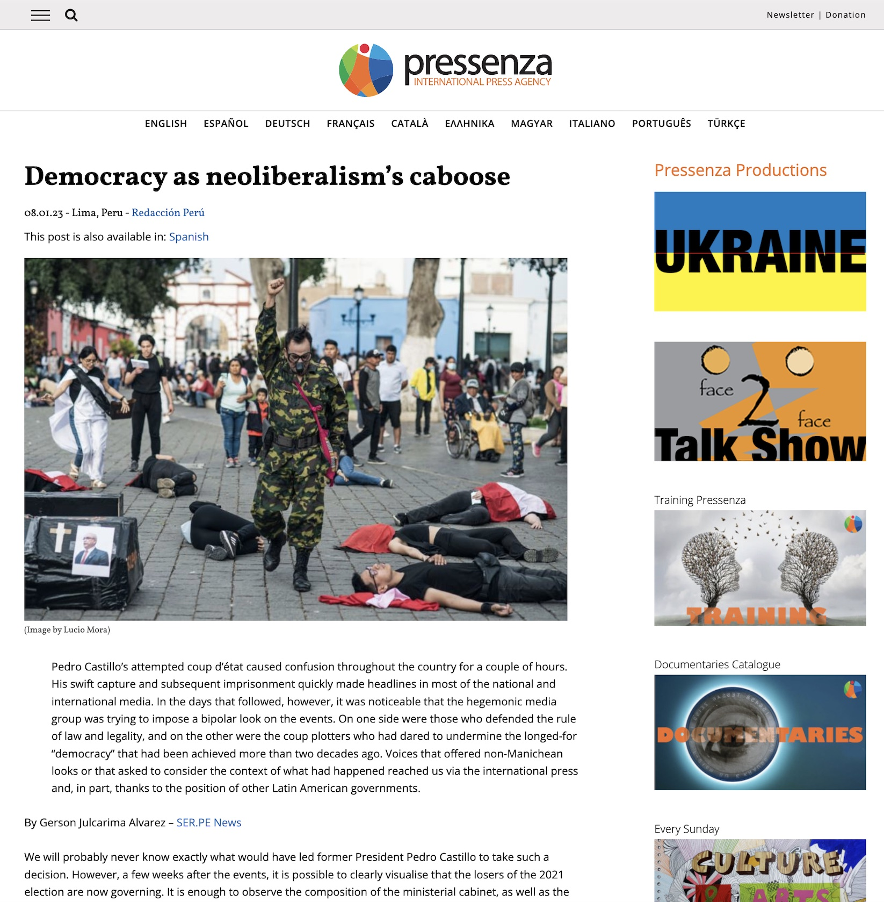
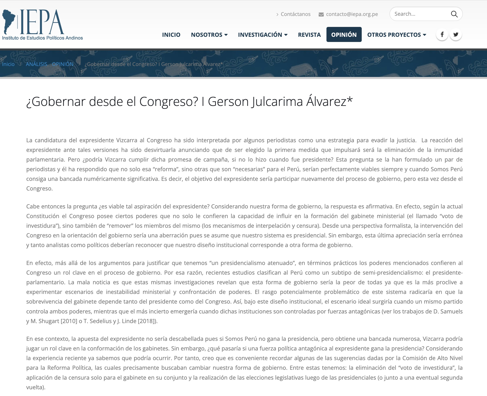

```{r panelset, layout='l-page', echo=FALSE}
xaringanExtra::use_panelset()
xaringanExtra::style_panelset_tabs(foreground = "honeydew", background = "#0F2E3D")
```
Recent participation in conferences, seminars,  workshops,  interviews and the latest opinion pieces. 

::::: {.panelset}

::: {.panel}

#### Guest Speaker {.panel-name}

```{r setup, include=FALSE}

library(vembedr)

knitr::opts_chunk$set(echo = FALSE)
```
<li> **Speaker**: *Elecciones Municipales Complementarias de Centros Poblados 2023*, Martes Electoral, Escuela Electoral y de Gobernabilidad, December 13, 2023.  </li>
``` {r}
embed_url("https://www.youtube.com/watch?v=56dFvBzFzBY") %>%
  use_align("center") %>% use_start_time("4m25s")
```
<li> **Speaker**: *Pueblos Indígenas y Representación Política*, Seminario Internacional - Los organismos electorales y el estado de la democracia en AL - JNE (Perú), OEP (Bolivia) y CNE (Ecuador), September 15, 2023.  </li>
``` {r}
embed_url("https://www.youtube.com/watch?v=gqH1vwKLlb0") %>%
  use_align("center") %>% use_start_time("1h48m44s")
```
<li> **Speaker**: *El voto religioso en las últimas elecciones en América Latina: los casos de Argentina y Perú*, Unidad de Posgrado-Facultad de Ciencias Sociales, UNMSM, March 7, 2023.  </li>
``` {r}
embed_url("https://www.youtube.com/watch?v=-_TsyiBxIFY") %>%
  use_align("center") %>% use_start_time("42m50s")
```
<li> **Moderator**: *Roundtable "Peruvian Crisis: Reasons and Outcomes"*, University of Alberta, Canada, December 19, 2022.</li>
```{r}

```
<li> **Speaker**: *¿Hacia un resurgimiento de la identidad "Quechua"?*, Limateca - Colectivo Apu Sharu,August 11, 2022.</li>
```{r}
embed_url("https://www.youtube.com/watch?v=QJ0oVHcxk_g") %>%
  use_align("center") %>% use_start_time("28m53s")
```
<li> **Disccusant**: *Conservadurismo Religioso y Política en el Perú: Una revisión histórica*, Conferencias Religión y Política, Diplomado en Religión y Política, Unidad de Pos Grado - UNMSM, February 22, 2022. </li>
```{r}
embed_url("https://www.youtube.com/watch?v=liU94Fc6taA") %>%
  use_align("center") %>% use_start_time("1h4m38s")
```
<li> **Interviewed**: *Perspectivas para analizar el rol de los partidos políticos*, POLITEAMA, December 27, 2021. </li>
```{r}
embed_url("https://www.youtube.com/watch?v=bgiNMujQ07s&t=1134s") %>%
  use_align("center")
```
<li> **Speaker**: *Los límites de entender la democracia como "democracia liberal"*, Sesión 3, Diálogos DEMOS, Universidad Nacional Mayor de San Marcos and Fundación Friedrich Ebert (FES) , October 2, 2021.</li>
```{r}
embed_url("https://www.youtube.com/watch?v=zZsSJEwRCcY") %>%
  use_align("center")  %>% use_start_time("1h33m45s")
```

:::

::: {.panel}

#### Workshops {.panel-name}

<li>**An Introduction to Electoral Studies**. Workshop on Electoral Systems and
Political Parties - Department of Political Science at National University of San Marcos, Lima, Peru, 24 and 31 July, 2021. *(online)*. </li> \medskip

<li> **Workshop on Research Methodology in Electoral Studies** Electoral
and of Governability School - National Court of Elections, Lima, Peru, 23 June - 5 July, *(online)*. </li> \medskip

:::

::: {.panel}

#### Opinion Pieces {.panel-name}

<li> [*No hay estado, ni nación*](https://www.noticiasser.pe/no-hay-estado-ni-nacion), **NoticiasSer.Pe**, August 4, 2023. \medskip </li>

```{r}
knitr::include_url("https://www.noticiasser.pe/no-hay-estado-ni-nacion")
```


<li> [*Democracy as neoliberalism’s caboose*](https://www.pressenza.com/2023/01/democracy-as-neoliberalisms-caboose/), **Pressenza - International Press Agency**, January 8, 2023. \medskip </li>

```{r}

```

<li> [*¿Gobernar desde el Congreso?*](http://www.iepa.org.pe/gobernar-desde-el-congreso-i-gerson-julcarima-alvarez/), **Instituto de Estudios Políticos Andinos**, 14 de Febrero, 2021. \medskip </li>

```{r}
knitr::include_graphics()
```

<li> [*¿Crisis o sinceramiento de la representación política en el Perú?*](https://propuestapais.pe/noticia/crisis-o-sinceramiento-de-la-representacion-politica-en-el-peru/), **Propuesta País**, 5 de Enero, 2020. [published also in **Diario Uno**, 16 de Enero, 2020. \medskip </li>


```{r}
knitr::include_url("https://propuestapais.pe/noticia/crisis-o-sinceramiento-de-la-representacion-politica-en-el-peru/")
```


<li> [*The Brazilian presidential election of 2018: Does a cartel of parties produce mavericks?*](https://presidential-power.net/?p=9608), **Presidential Power**, May 22, 2019. \medskip </li>   

```{r}
knitr::include_url("https://presidential-power.net/?p=9608")
```

:::

:::::
