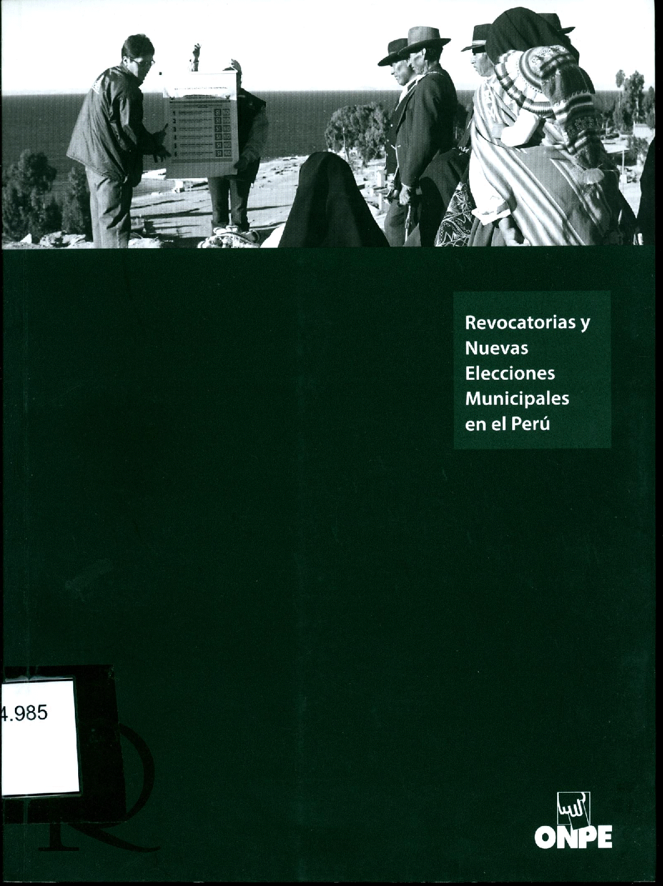

----

### **Book Chapters**

<a href="https://www.onpe.gob.pe/modEducacion/Publicaciones/ciudadania-politico.pdf" target="_blank">¿Afecta la “forma de gobierno” el funcionamiento de la democracia representativa? Algunas reflexiones a partir del caso peruano.</a> In Joan Lara Amat y León (Ed.).La ciudadanía y lo político. Ciudadanía y crisis de la democracia liberal en un mundo en transformación. Lima: ONPE, Fac. de Letras y Ciencias Humanas y Escuela de Ciencia Política de la Univ. Nac. Mayor de San Marcos, 2020, pp. 179-186.   

<a href="https://www.onpe.gob.pe/modEducacion/Publicaciones/sanciones-multas-abstencionismo.pdf" target="_blank">Multas electorales, ausentismo y participación electoral en el Perú (2002-2018)</a>, with Germán Feierherd y Guadalupe Tuñon. In Manuel Valenzuela (Coord.).Sanciones, multas y abstencionismo electoral en el Perú.Tres estudios sobre participación electoral y voto obligatorio</a>. Lima: ONPE, 2019, pp. 137-174.   

<a href="https://www.onpe.gob.pe/modEducacion/Publicaciones/democracia-participacion-electoral.pdf" target="_blank">Elections and Evangelicals in Peru (1979-2006)</a>. In Fernando Armas y otros (Eds.). <a href="http://ira.pucp.edu.pe/libreria/publicaciones/politicas-divinas-religion-diversidad-y-politica-en-el-peru-contemporaneo/" target="_blank">Religión y poder en el Perú republicano</a>. Lima: Instituto Riva-
Agüero–PUCP, 2008, pp. 387-410. [Republished in Sánchez, Marte y Manuel Valenzuela (Eds.). Democracia, Participación y representación Electoral en el Perú. Lima: ONPE, 2020, pp. 97-118]   

---- 
### **Working Papers(as coauthor)**

 
 

 
 

 
 

 
 

 

 
 

 
 

 
 

 
 

 
 

