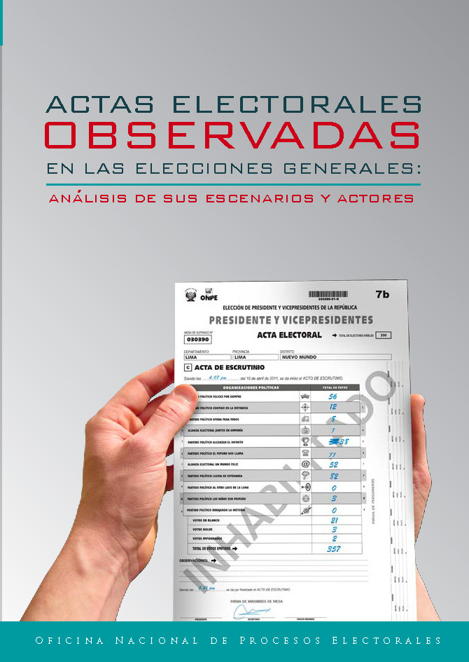
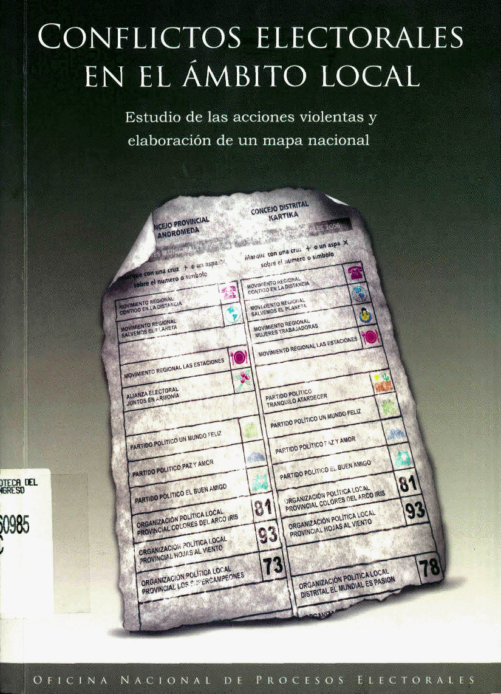
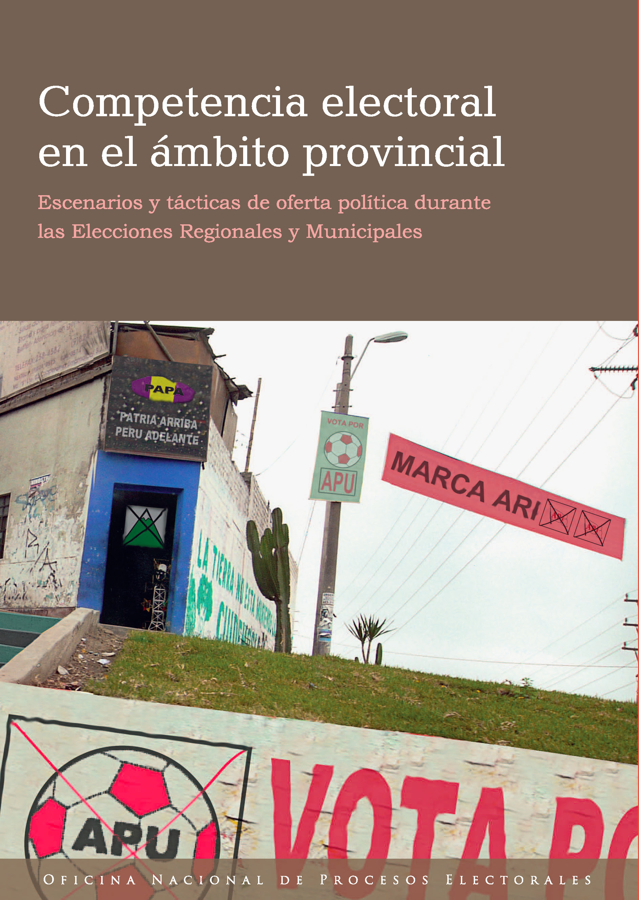
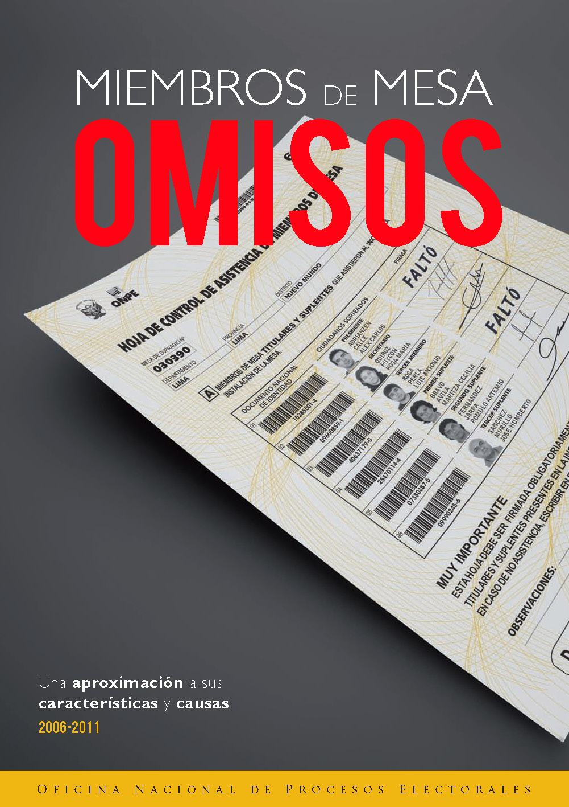
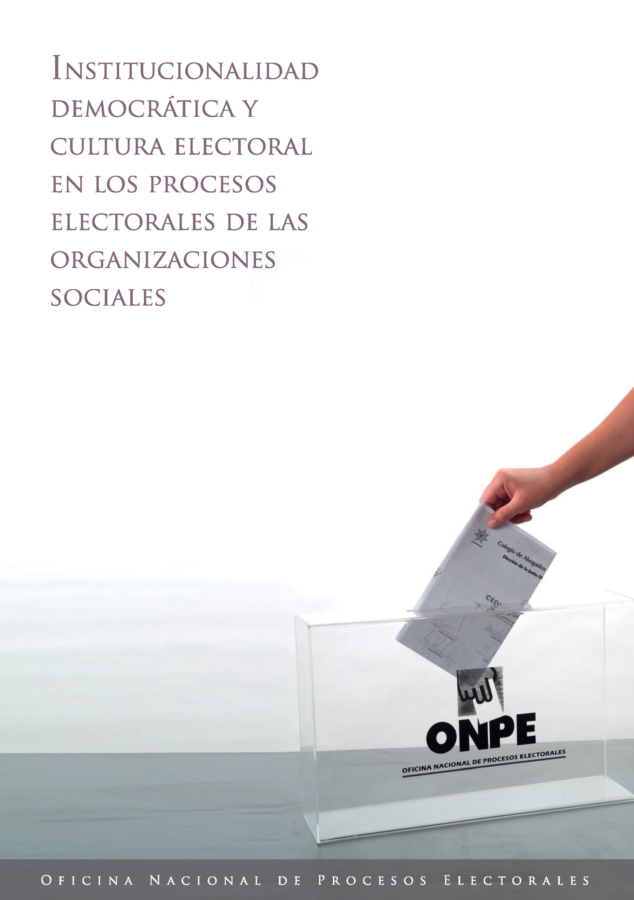

<style>
.separador1{
    height: 10px;
    clear: both;
    width: auto;
}
.separador2{
    width:3%;
    height: 1px;
    float:left;
}
img {
     width: 20%;
     border: 1px solid black;
    border-radius: 3%;
}
</style>
```{r panelset, layout='l-page', echo=FALSE}
xaringanExtra::use_panelset()
xaringanExtra::style_panelset_tabs(foreground = "honeydew", background = "#0F2E3D")
```
Research Interest: Indigenous politics, semi-presidentialism in new democracies, parties and party systems, and religion and politics.

::::: {.panelset}

::: {.panel}

#### Articles {.panel-name}

#### PEER-REVIEWED ARTICLES

<li> [*Comprehensive Sex Education, Sexual Risk, and Religion: Comparative Analysis of National Youth Surveys of Guatemala, Peru, Chile, Mexico, and Uruguay*](https://link.springer.com/article/10.1007/s41603-023-00190-0). **International Journal of Latin American Religions**, 2023 [wiht René Castro Vergara] </li> \medskip

<li> [*Does the monetary cost of abstaining increase turnout? Causal evidence from Peru*](https://www.sciencedirect.com/science/article/abs/pii/S026137942100130X). **Electoral Studies**, Volume 75, February 2022 [with German Feierherd and Gudalupe Tuñon] </li> \medskip

<li> [*¡Quememos las urnas por una elección justa! Violencia electoral y regalías mineras en las elecciones municipales peruanas*](https://revistas.onpe.gob.pe/index.php/elecciones/article/view/155/153). **Elecciones**, vol. 17, Nro. 18, 2018, pp. 11-52 [with Anthony Pezzola] </li> \medskip

<li> [*La democracia peruana según las Elecciones Generales 2016: límites y desafíos del diseño institucional*](https://revistas.onpe.gob.pe/index.php/elecciones/article/view/174/173). **Elecciones**, vol. 15, Nro. 16, 2016, pp. 53-76. [with Manuel Valenzuela]  </li> \medskip


##### OTHER ARTICLES

<li> [*El ciudadano evangélico. Un esbozo historico-interpretativo sobre la construccion de la identidad social de los protestantes en el Perú*](https://cedepperu.org/publicaciones/revista-socialismo-y-participacion). **Socialismo y Participación**, 1 (100), 2006, pp. 149–172. </li> \medskip

<li> [*El pentecostalismo y la toma de tierras en Cerro de Pasco (1958-1967)*](https://revistas.ucsp.edu.pe/index.php/Allpanchis/article/view/507/514). **Allpanchis**, 37 (65), 2005, pp. 99–108. </li> \medskip


:::

::: {.panel}

#### Book Chapters {.panel-name}

<li> [*¿Afecta la “forma de gobierno” el funcionamiento de la democracia representativa? Algunas reflexiones a partir del caso peruano*](https://www.onpe.gob.pe/modEducacion/Publicaciones/ciudadania-politico.pdf). In Joan Lara Amat y León (editor), **La ciudadanía y lo político. Ciudadanía y crisis de la democracia liberal en un mundo en transformación**. Lima: ONPE, Fac. de Letras y Ciencias Humanas y Escuela de Ciencia Política de la Univ. Nac. Mayor de San Marcos, 2020, pp. 179-186.\medskip </li>


<li> [*Multas electorales, ausentismo y participación electoral en el Perú (2002-2018*](https://www.onpe.gob.pe/modEducacion/Publicaciones/sanciones-multas-abstencionismo.pdf). In Manuel Valenzuela (coord.), **Sanciones, multas y abstencionismo electoral en el Perú. Tres estudios sobre participación electoral y voto obligatorio**. Lima: ONPE, 2019, pp. 137-174. [with Germán Feierherd y Guadalupe Tuñon] \medskip </li>

<li> [*Elecciones y Evangélicos en el Perú (1979-2006)*](http://www.librosperuanos.com/libros/detalle/9770/Politicas-divinas-Religion-diversidad-y-politica-en-el-Peru-contemporaneo). In Fernando Armas y otros (editores). **Religión y poder en el Perú republicano**. Lima: Instituto Riva-
Agüero–PUCP, 2008, pp. 387-410. [Republished in Sánchez, Marte y Manuel Valenzuela (editores). Democracia, Participación y representación Electoral en el Perú. Lima: ONPE, 2020, pp. 97-118] </li>

:::


::: {.panel}


#### Ongoing Work {.panel-name}


<li> *La movilización electoral de las identidades étnicas en el Perú*  \medskip </li>  

<li> *The Ministers and the Ballot Boxes: Implications of the Evangelicals' Electoral  Mobilization in Peru* \medskip </li> 

<li> *Electoral conflicts and local democracy in Peru (2010-2018) (with J.P. Milanese and J. Tarrillo)* \medskip  </li> 


:::


::: {.panel}

#### Working Papers {.panel-name}

<a href="http://www.onpe.gob.pe/modEducacion/Publicaciones/dt-actas.pdf" target="_blank">

</a>

<div class="separador2"> </div> 

<a href="http://www.onpe.gob.pe/modEducacion/Publicaciones/conflictos_book.pdf" target="_blank"> 
</a>

<div class="separador2"> </div> 

<a href="http://www.onpe.gob.pe/modEducacion/Publicaciones/L-0081.pdf" target="_blank">

</a>

<div class="separador2"> </div> 

<a href="http://www.onpe.gob.pe/modEducacion/Publicaciones/L-0058.pdf" target="_blank"> 
</a>
<br>

<div class="separador1"> </div> 

<a href="http://www.onpe.gob.pe/modEducacion/Publicaciones/DT-27Miembros_Omisos.pdf" target="_blank"> 
</a>


<div class="separador2"> </div> 

<a href="https://www.iidh.ed.cr/multic/UserFiles/Biblioteca/CAPEL/3_2011/27d471f8-848e-4708-a58f-9476d9da982a.pdf" target="_blank"> 
</a>

<div class="separador2"> </div> 

<a href="https://www.iidh.ed.cr/multic/UserFiles/Biblioteca/CAPEL/11_2012/bb0775ec-0982-407c-aa81-d60f5b3bbfa9.pdf" target="_blank">

</a>

<div class="separador2"> </div> 

<a href="http://www.onpe.gob.pe/modEducacion/Publicaciones/DT-26Percepciones_sobre_la_gestion.pdf" target="_blank"> 
</a>

<div class="separador1"> </div> 

<a href="http://www.onpe.gob.pe/modEducacion/Publicaciones/reporte_01.pdf" target="_blank">

</a>

:::

:::::
